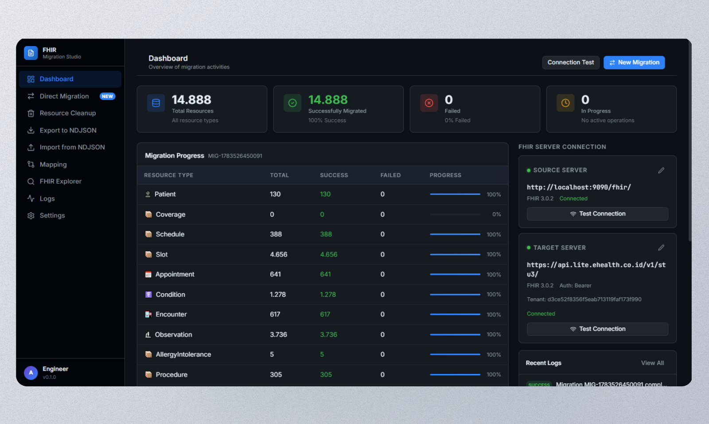
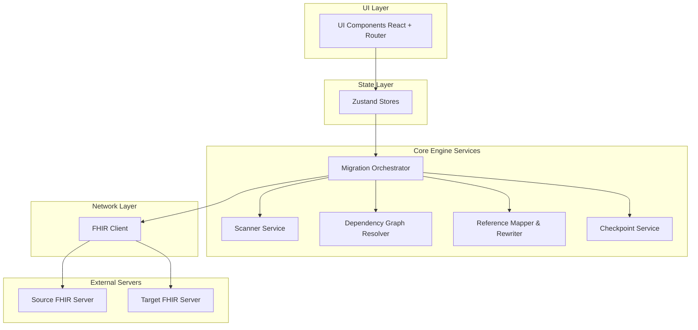

# FHIR Migration Studio 🚀

<!-- BADGES -->
<div align="left">
  
  
  
  
  
</div>

> A production-grade desktop application for orchestrating dependency-driven HL7 FHIR resource migrations between servers, complete with offline backup (NDJSON) and legacy data import support.

---

## 🖥️ Preview



---

## 💡 Overview

**FHIR Migration Studio** is an advanced desktop engineering tool built to simplify data migrations between health information systems utilizing the **HL7 FHIR (Fast Healthcare Interoperability Resources)** standard. 

Rather than relying on manual file exports, scripting, or custom database queries, this application features a complete guided migration workflow. It automatically analyzes resource dependency graphs, rewrites referenced IDs dynamically, maps business identifiers, performs validation checks, and generates real-time migration reports.

### Who is this for?
* **Healthcare IT Engineers** migrating records between legacy systems and modern FHIR registries.
* **Hospitals & Clinics** undergoing EMR transitions.
* **Healthcare Software Vendors & Integrators** looking for a stable staging tool to import historical patient charts.

---

## ✨ Key Features

* **🔄 Direct Server-to-Server Migration**: Connect target and source servers using base URLs. Perform migrations over HTTP/HTTPS with support for custom headers (such as `X-Tenant-Id`) and authentication (Bearer tokens).
* **📈 Dependency-driven Migration Queue**: Automatically sorts and processes FHIR resource types (e.g., `Patient` ➔ `Encounter` ➔ `Observation`) to maintain strict schema integrity and prevent orphan references.
* **⚡ Checkpoint & Crash Recovery**: Saves migration progress state incrementally in `{AppLocalData}/checkpoints/*.json`. Resumes precisely from the last successfully uploaded batch if a network or server failure occurs.
* **✏️ Dynamic Reference Rewriting**: Automatically maps old server IDs to new server IDs for pre-existing dependencies (like `Practitioner`, `Location`, `HealthcareService`, `Organization`) based on user-defined replacement rules.
* **📄 Bulk FHIR (NDJSON) Export/Import**: Full export support to download FHIR data into `.ndjson` files for disaster recovery, backups, or offline migrations, and import them back onto any server.
* **📊 Legacy EMR Integration (Excel-to-FHIR)**: Import legacy tabular spreadsheets (Excel files) and map rows directly to complex nested FHIR resource objects.
* **🔍 Server Explorer & Inspector**: Connect and query resources directly from the dashboard using an interactive JSON tree viewer.
* **🧹 Sandbox Resource Cleanup**: An essential utility to scan and wipe migrated resources during testing phases using custom metadata markers (`initiator-component`).

---

## 🛠️ System Architecture

The application is structured around a decoupled layered design, separating the React frontend rendering logic from the state and core TypeScript orchestration services.



### Complex Technical Challenges Resolved:
1. **HTTP 413 (Content Too Large) Mitigation**: Standard FHIR uploads fail when bundling large datasets. The pipeline chunks resources into small, configurable transaction bundles (default: `100` resources per payload) to optimize throughput.
2. **Circular Patient Links (`Patient.link.other`)**: Resolves cyclical patient reference schemas using a **Two-Stage Upload process**:
   * **Stage 1**: Upload Patients with their `link` array temporarily stripped to avoid unresolved references.
   * **Stage 2**: Perform bulk update `PUT` requests to restore the links once all Patient IDs are successfully generated on the target server.
3. **Transaction Batching Order**: Enforces migration in strict topological order based on FHIR relationships to avoid relational errors:
   ```
   Questionnaire ➔ Patient ➔ Coverage ➔ Schedule ➔ Slot ➔ Appointment ➔ ... ➔ Encounter ➔ Composition
   ```

---

## 📦 Tech Stack

| Category | Technology | Purpose |
| :--- | :--- | :--- |
| **Core Client** | React 19, TypeScript 5.8 | User interface components and type safety. |
| **Desktop Shell** | Tauri v2 | Native desktop window manager, local filesystem access, and fast builds. |
| **State Management** | Zustand | Persisted, light-weight client state. |
| **Styling** | Tailwind CSS v4 | High-fidelity, modern UI design. |
| **Routing** | React Router v7 | Seamless page transitions. |
| **Utility & Icons** | Lucide React | High-quality developer-friendly vector icons. |

---

## 🚀 Getting Started

### Prerequisites

Ensure you have the following installed on your machine:
* **Node.js** (v18 or higher)
* **Rust toolchain** (Required for Tauri compilations. Install via [rustup](https://rustup.rs/))
* **C++ Build Tools / Visual Studio Build Tools** (For Windows targets)

### 1. Installation

Clone the repository and install the dependencies:
```bash
# Clone the repository
git clone https://github.com/NafisHandoko/fhir-migration-studio.git
cd fhir-migration-studio

# Install dependencies
npm install
```

### 2. Development

Run the Tauri desktop application in hot-reloading development mode:
```bash
npm run tauri dev
```

### 3. Build & Package

Generate a production-ready desktop installer (`.msi`, `.exe`, or platform-specific binaries):
```bash
npm run tauri build
```

---

## 📁 Project Structure

Below is the directory structure layout showing where key layers reside:

```text
fhir-migration-studio/
├── src/
│   ├── types/          # Strict TS definitions for FHIR, server configurations, and mapping rules
│   ├── store/          # Zustand global stores (e.g., serverStore, migrationStore, logStore)
│   ├── services/       # Core business logic (pure TypeScript - CLI & Core migration engines)
│   │   ├── fhirClient.ts             # Native wrapper around HTTP/FHIR endpoints
│   │   ├── migrationOrchestrator.ts  # Coordinates the scanning, rewriting, and upload pipelines
│   │   ├── dependencyMigrator.ts     # Topological upload engine with transaction batching
│   │   ├── checkpointService.ts      # Local filesystem checkpoint persistence
│   │   └── referenceRewriter.ts      # Reference mapping and UUID replacements
│   ├── components/     # Reusable layout shells and UI primitives
│   └── pages/          # Individual router endpoints (Dashboard, Export, Explorer, Mapping)
├── src-tauri/          # Tauri Native Configuration (Cargo, icons, build targets)
├── docs/               # Detailed system design documents and FHIR schemas
├── package.json        # Project scripts and dependencies
└── README.md           # Portfolio presentation (this file)
```

---

## 📝 License

Distributed under the MIT License. See `LICENSE` for more information.

---

## 👤 Author

**Nafis Handoko**
* GitHub: [@NafisHandoko](https://github.com/NafisHandoko)
* Website: [NafisHandoko Portfolio](https://nafishandoko.my.id)